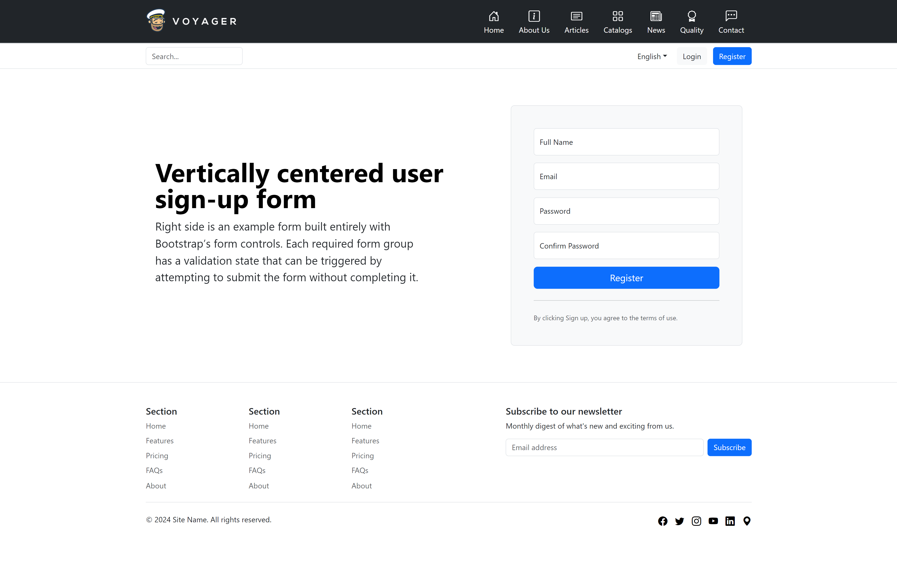

<p align="center"><a href="https://voyager.devdojo.com" target="_blank"></a></p>
<p align="center">
<a href="https://github.com/berkanumutlu/laravel-voyager/releases/tag/v1.0.0" target="_blank" rel="nofollow"></a>
<a href="https://github.com/berkanumutlu/laravel-voyager/stargazers" rel="nofollow"></a>
<a href="https://github.com/berkanumutlu/laravel-voyager/blob/master/LICENSE" target="_blank" rel="nofollow"></a>
<a href="https://github.com/thedevdojo/voyager/releases/tag/v1.7" target="_blank" rel="nofollow"></a>
<a href="https://laravel.com/docs/10.x" target="_blank" rel="nofollow"></a>
<a href="https://www.php.net/releases/8_1_28.php" target="_blank" rel="nofollow"></a>
<a href="https://getcomposer.org" target="_blank" rel="nofollow"></a>
<a href="https://www.docker.com" target="_blank" rel="nofollow"></a>
</p>

# Laravel Voyager

It is a project for Laravel Voyager with articles, news, catalogs, qualities, sliders, contact messages, tickets, social_media, currencies.

## Installation

```sh
$ docker-compose up -d
$ docker ps
$ docker exec -it {PHP8_CONTAINER_ID} bash
```

```sh
$ composer global require laravel/installer
```

```sh
$ composer global about
# Changed current directory to /root/.composer
# Composer - Dependency Manager for PHP - version 2.6.5
# Composer is a dependency manager tracking local dependencies of your projects and libraries.
# See https://getcomposer.org/ for more information.
```

```sh
$ export PATH="/root/.composer/vendor/bin:$PATH"
```

```sh
$ laravel new project (or composer create-project --prefer-dist laravel/laravel project)
```

```sh
$ cd project
$ composer require tcg/voyager 1.7 (For Laravel 10)
$ php artisan voyager:install (or php artisan voyager:install --with-dummy)
$ php artisan voyager:admin your@email.com --create
```

```sh
$ php artisan serve
```

## Screenshots

- Home


- About Us


- Articles


- Article Detail


- Catalogs


- News


- Quality


- Contact


- Login


- Register


- User Profile


- User Tickets


- User Ticket Detail


## License

The MIT License (MIT). Please see [License File](LICENSE) for more information.
